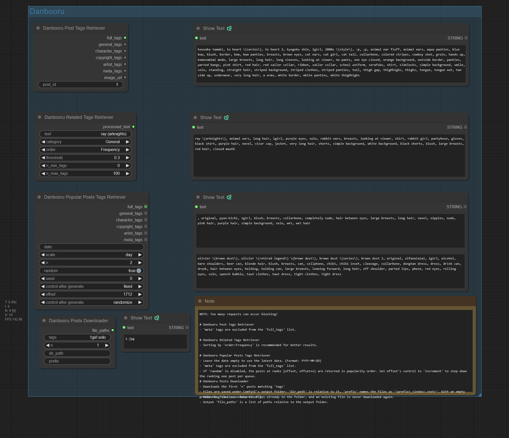

# ComfyUI-Danbooru-Pack

[English](README.md) | [한국어](README_ko.md)

Danbooru 포스트의 태그를 가져오고 Danbooru 이미지를 다운로드합니다.

## 사용법

**Danbooru Post Tags Retriever**에 포스트 id를 넣으면 카테고리별로 나뉜 태그와 이미지 URL이 나옵니다. **Danbooru Related Tags Retriever**는 태그 하나를 받아 Danbooru가 연관 짓는 태그들을 돌려줍니다. **Danbooru Popular Posts Tags Retriever**는 일간·주간·월간 인기 포스트의 태그를 무작위 표본으로, 또는 순위대로 하나씩 돌려줍니다. **Danbooru Posts Downloader**는 태그 검색 결과의 이미지를 output 폴더에 저장합니다.

> [!NOTE]
> 요청을 줄이기 위해 응답을 캐싱합니다: 특정 포스트(id 기준)는 프로세스 생존 동안, 가변 엔드포인트(popular / related / search)는 1시간. 과도하게 쓰면 여전히 Danbooru 레이트리밋에 걸릴 수 있습니다. `.env`에 Webshare 프록시를 설정할 수 있습니다([설정](#설정) 참고).

## 예시



## 설치

ComfyUI Manager에서 **ComfyUI-Danbooru-Pack**을 검색하거나:

```bash
cd ComfyUI/custom_nodes
git clone https://github.com/alchemine/comfyui-danbooru-pack
pip install -r comfyui-danbooru-pack/requirements.txt
```

## 노드 (`DanbooruPack/Danbooru`)

### Danbooru Post Tags Retriever

| 파라미터 | 타입 | 설명 |
|----------|------|------|
| `post_id` | STRING | Danbooru 포스트 ID |

| 출력 | 설명 |
|------|------|
| `full_tags` | 전체 태그 (캐릭터 + 저작권 + 아티스트 + 일반, 메타 제외) |
| `general_tags` | 일반 태그만 |
| `character_tags` | 캐릭터 태그만 |
| `copyright_tags` | 저작권 태그만 |
| `artist_tags` | 아티스트 태그만 |
| `meta_tags` | 메타 태그만 |
| `image_url` | 이미지 URL |

### Danbooru Related Tags Retriever

| 파라미터 | 타입 | 기본값 | 설명 |
|----------|------|--------|------|
| `text` | STRING | (필수) | 입력 태그 |
| `category` | ENUM | "General" | 태그 카테고리 필터 (General/Character/Copyright/Artist/Meta) |
| `order` | ENUM | "Frequency" | 정렬 순서 (Cosine/Jaccard/Overlap/Frequency) |
| `threshold` | FLOAT | 0.3 | 최소 유사도 임계값 |
| `n_min_tags` | INT | 0 | 반환할 최소 태그 수 |
| `n_max_tags` | INT | 100 | 반환할 최대 태그 수 |

### Danbooru Popular Posts Tags Retriever

| 파라미터 | 타입 | 기본값 | 설명 |
|----------|------|--------|------|
| `date` | STRING | "" | 날짜 (YYYY-MM-DD 형식, 비워두면 최신) |
| `scale` | ENUM | "day" | 시간 범위 (day/week/month) |
| `n` | INT | 1 | 가져올 포스트 수 |
| `random` | BOOLEAN | True | `True`: 무작위 `n`개 / `False`: 인기 순위의 `[offset, offset+n)` 구간 |
| `seed` | INT | 0 | 랜덤 시드 (`random=True`일 때만 사용) |
| `offset` | INT | 0 | 인기 순위의 시작 위치 (`random=False`일 때만 사용). `control_after_generate`가 붙어 있어 *increment*로 두면 큐마다 순위를 한 칸씩 내려감. 해당 순위가 없으면 에러. |

출력은 **리스트**(포스트당 한 칸): `full_tags` / `general_tags` / `character_tags` / `copyright_tags` / `artist_tags` / `meta_tags`.

> [!TIP]
> 순위를 하나씩 훑으려면 `random=False`, `n=1`, `offset` 컨트롤을 *increment*로 설정. 큐를 누를 때마다 다음 인기글을 반환하며, 그 글이 있는 페이지 1개만 가져옴.

### Danbooru Posts Downloader

| 파라미터 | 타입 | 기본값 | 설명 |
|----------|------|--------|------|
| `tags` | STRING | "" | 검색 태그 |
| `n` | INT | 1 | 다운로드할 이미지 수 |
| `dir_path` | STRING | "" | 출력 디렉터리 (ComfyUI output 폴더 기준 상대 경로) |
| `prefix` | STRING | "" | 파일명 접두사 |

## 설정

### Webshare 프록시 (선택)

`.env`에 `WEBSHARE_PROXY_USERNAME` / `WEBSHARE_PROXY_PASSWORD`를 넣으면(`.env.example` 참고) Danbooru 노드가 프록시를 경유합니다. 비워 두면 직결합니다.

### SNI 호스트 (선택)

`danbooru.donmai.us`로의 TLS 핸드셰이크가 리셋되는 네트워크(SNI 필터링)에서는 `.env`에 `DANBOORU_SNI_HOST=safebooru.donmai.us`를 넣습니다. 연결은 Danbooru와 인증서를 공유하는 그 이름으로 열리고 `Host` 헤더는 `danbooru.donmai.us`를 유지하므로 응답은 Danbooru 본체의 것입니다. `cdn.donmai.us` 이미지 다운로드는 영향이 없습니다. Playwright 변형은 지원하지 않습니다.

### Playwright 변형

노드는 순수 `requests`(`nodes/danbooru_requests.py`)를 사용하며 브라우저 의존성이 없습니다. Playwright 기반 변형(`nodes/danbooru.py`)도 대체용으로 소스에 남겨두었으며, 그걸 쓰려면 `__init__.py`의 import를 바꾸고 `pip install playwright`를 실행하세요. 완전한 호환은 아닙니다: Popular Posts 노드에 `offset` 파라미터가 없고(`random=False`는 순위를 따라가는 대신 상위 포스트를 score 순으로 재정렬해 반환), 모든 응답을 TTL 없이 프로세스 생존 동안 캐싱합니다.

## 테스트

실제 Danbooru API를 호출하므로 네트워크 접속(또는 `.env`의 Webshare 프록시)이 필요합니다. `pytest`는 `pyproject.toml`의 `test` dependency group에 있고 `requirements.txt`에는 들어가지 않습니다:

```bash
uv pip install -r requirements.txt --group test
pytest tests
```

## 라이선스

GPL-3.0 — [LICENSE](LICENSE) 참조.
